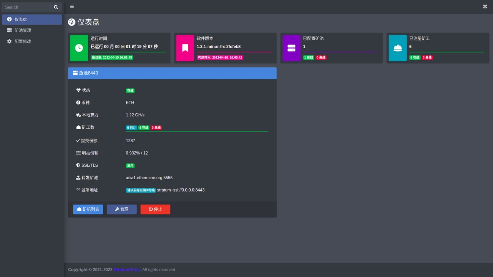

# StratumProxy
  

# 关于我们
<a href="https://t.me/StratumProxy">StratumProxy Telegram交流群</a>  
<b>声明：此源码仅供学习交流使用，不对您使用造成的后果负责！</b>  

## 捐赠
```bigquery
如果程序对你有帮助，您可以自愿捐赠：
ETH-ERC20 / Polygon
0xB775f5396eBe589C770069Bfcc421Ca135E9a326
Tron-TRC20
TKJVn8Xrs23zi5wgJptxjw4yL9mDxtuSxf
```

## 更新日志
v1.3.1：本程序经慎重考虑，现决定将此程序完全开源并不断更新维护，供矿友研究和使用！！！

## 编译
1. 请自行安装 Golang （>1.16 && 准备编译所需环境
2. 从GitHub拉取源码并切换到编译目录   
编译Linux版本：
```
CGO_ENABLED=0 go build --tags self_cfg,publish_log
```
编译Windows版本：
```
CGO_ENABLED=0 GOOS=windows go build --tags self_cfg,publish_log
```

## Windows 直接下载运行 
https://github.com/ethpoolproxy/stratumproxy/releases

## Linux一键安装

```bash
bash <(curl -s -L https://raw.githubusercontent.com/ethpoolproxy/stratumproxy/master/install.sh)
```

---

### 查看运行情况
```bash
systemctl status stratumproxy
```

---
## Linux手动安装
```bash
wget https://github.com/ethpoolproxy/stratumproxy/releases/download/v1.3.1/stratumproxy_v1.3.1 -O /usr/bin/stratumproxy
wget https://raw.githubusercontent.com/ethpoolproxy/stratumproxy/stratumproxy.service -O /etc/systemd/system/stratumproxy.service
systemctl daemon-reload
systemctl enable --now stratumproxy
```

## 重要说明

```bigquery
开发者费用 可通过修改源代码来删除或自定义
本软件为0.8%的开发者费用,可以自行抓包验证
程序开发者抽水默认为双抽，比例分别为百分之0.3、百分之0.5，如觉得软件对您有所帮助，请保留我们的开发者抽水或对我们的钱包地址进行捐赠
该软件系统占用极小,开最便宜的腾讯云服务器即可，脚本自带腾讯云云监控卸载工具（不要使用轻量服务器,轻量网络极差）
```
